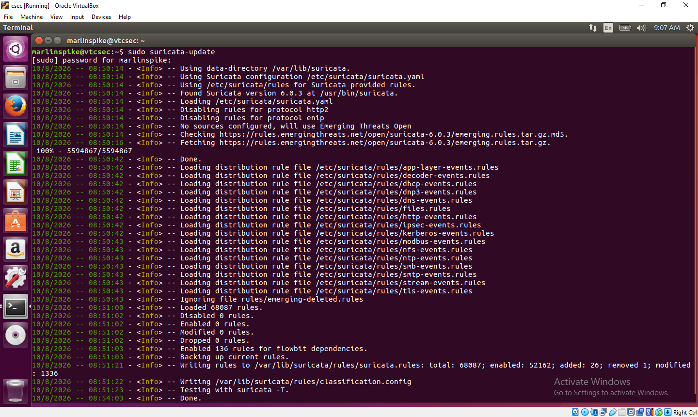
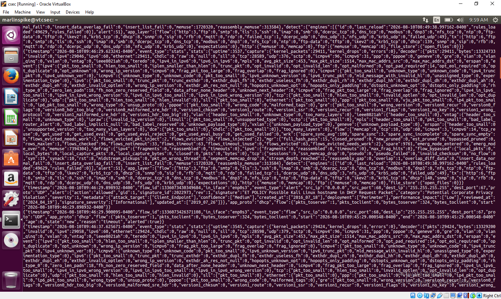
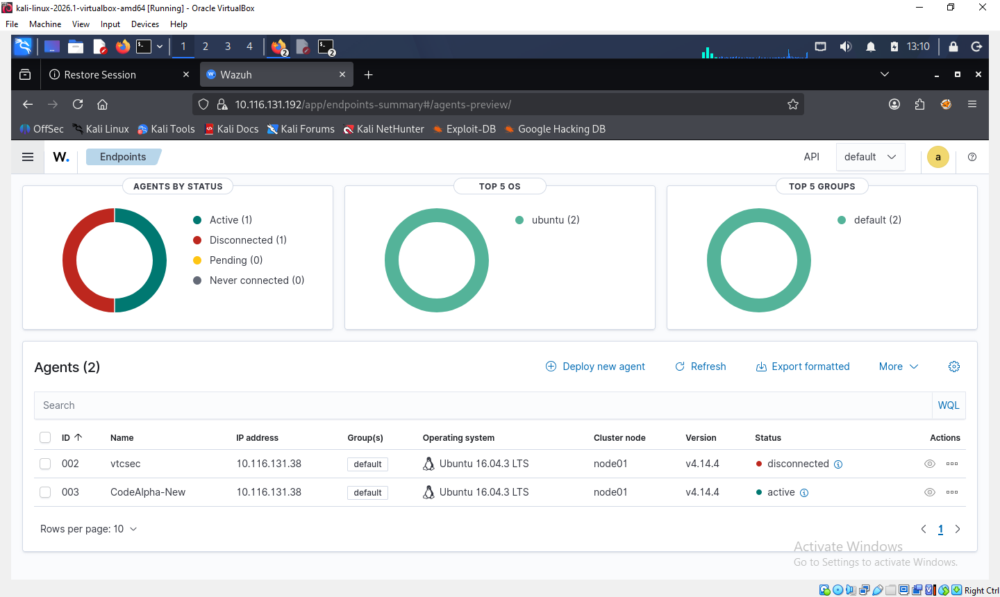

# Task 4: Network Intrusion Detection System

## Project Overview

This project demonstrates the setup and use of a Network Intrusion Detection System (NIDS) using Suricata to monitor network traffic and detect suspicious or potentially malicious activity.
thfyThe project provides pratical experience in network security monitoring, intrusion detection,security rules, alert generation, log analysis, and incident response.

## Objectives

The objective of this task was to configure and demonstrate a Network Intrusion Detection System (NIDS) using Suricata and Wazuh. The system was used to monitor network traffic,identify suspicious activity, generate security alerts,and provide centralized monitoring.

## Tools Used

- Ubuntu Linux
- Suricata IDS
- Wazuh
- Kali Linux
- VirtualBox
- Linux networking tools

## Network Configuration

The Suricata IDS is configured on an Ubuntu viral machine.

- **Operating System:** Ubuntu Linux
- **Network Interface:** enp0s3
- **IP Adress:** Private lab network address

## 1. Suricata Configuration

Suricata was installed and configured on the  Ubuntu machine.

The network interface monitored by Suricata was:

enp0s3

The Suricata configuration was tested using:

bash
sudo suricata -T -c /etc/suricata/suricata.yaml

### Screenshot

2. Suricata Rules

Suricata rules were update using:

sudo suricata-update

The update successfully loaded more than 68,000 rules.

### Screenshot

3. Network Traffic Monitoring

Suricata was configured to monitor network traffic and record events in:

/var/log/suricata/eve.json

The logs contained flow, statistics, and alert events.

4.Intrusion Detection Alert 

During testing, Suricata generated an alert identifying suspicious network activity.

The alert was recorded in the Suricata eve.json log.

### Screenshot

5. Wazuh Integration 

Wazuh was used for centralized security monitoring.

The Ubuntu machine was enrolled as CodeAlpha agent and successfully connected to the Wazuh manager.

The CodeAlpha agent was confirmed as Active in the Wazuh dashboard.

### Screenshot

6. Results

The completed setup successfully demonstrated:

. Network traffic monitoring using Suricata
. Suricata rule management and updates.
. Detection and logging of network security events.
. Generation of intrusion detection alerts.
. Integration of Suricata logs with Wazuh.
. Centralized monitoring through the Wazuh dashboard.

7. Conclusion

This task provided pratical experience in deploying and operating a network intrusion detection system. Suricata was used to monitor network traffic and identify suspicious activity, while Wazuh provided centralized security monitoring and visibility.

The exercise improved my understanding of network monitoring, IDS alerts, security event analysis, and the integration of security tools within a cybersecurity environment.

## Author

Ekpenyong Peace Inemesit

## Intership

CodeAlpha Cyber Security internship
